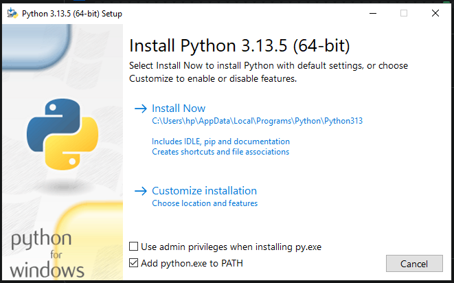
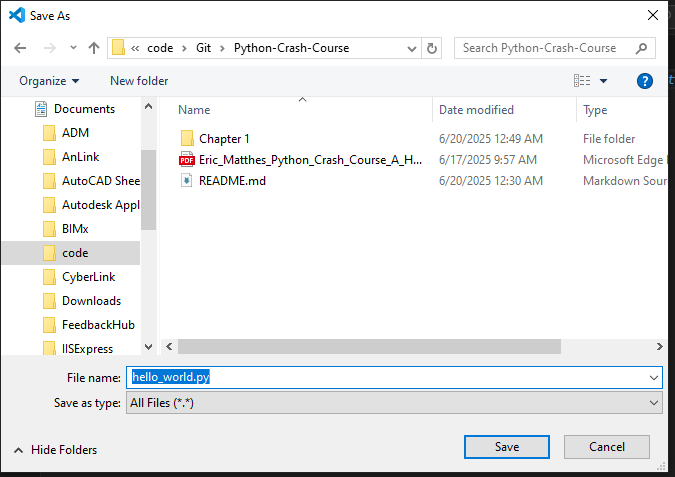
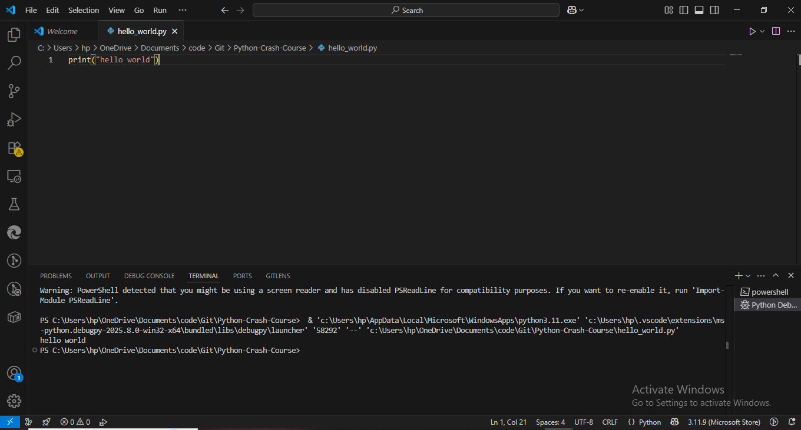

# Chapter 1 python crash course

## How to install and setting python IDE and python text editor in Window, Linux and Mac and Android Operating System.

### In window 
#### step 1 check if python is installed by clicking ctrl + r then enter cmd then click enter after that write python in cmd if its exists its shows python version if not its show an error.
#### step 2 if python not installed in windows then goto brower such as firefox, chrome or microsoft edge enter url https://wwww.python.org then download for windows download latest version is recommanded.
#### step 3 after download exe file open and click right on add python.exe to PATH then click install now and wait until its installed.

#### step 4 now check in cmd as python is installed :white_check_mark:.
#### step 5 install texteditor for python example vs code, sublime text editor, anaconda etc, for now vs code.
#### step 6 download vs code fron microsoft store or https://www.code.visualstudio.com then click download for windows.
#### step 7 install vs code.
#### step 8 in vs code write your first python by clicking ctrl + n then click ctrl + s example file name "hello_world.py" then code 'print("Hello World")' then click f5 :white_check_mark: 

