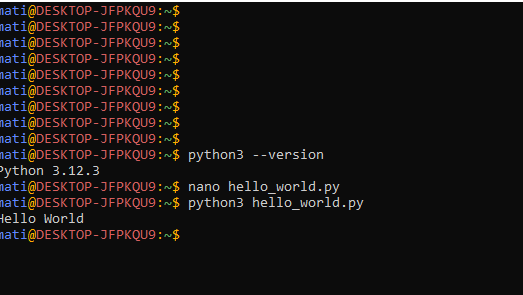

# Chapter 1 python crash course

## How to install and setting python IDE and python text editor in Window, Linux and Mac and Android Operating System.

  ### For window 
#### step 1 check if python is installed by clicking ctrl + r then enter cmd then click enter after that write python in cmd if its exists its shows python version if not its show an error.
#### step 2 if python not installed in windows then goto brower such as firefox, chrome or microsoft edge enter url https://wwww.python.org then download for windows download latest version is recommanded.
#### step 3 after download exe file open and click right on add python.exe to PATH then click install now and wait until its installed.

#### step 4 now check in cmd as python is installed :white_check_mark:.
#### step 5 install texteditor for python example vs code, sublime text editor, anaconda etc, for now vs code.
#### step 6 download vs code fron microsoft store or https://www.code.visualstudio.com then click download for windows.
#### step 7 install vs code.
#### step 8 in vs code write your first python by clicking ctrl + n then click ctrl + s example file name "hello_world.py" then code 'print("Hello World")' then click f5 

  ### Linux(Ubuntu)
#### step 1 first open terminal by clicking  ctrl + alt + t.
#### step 2 then enter 'python3 --version' see 3.x.x if installed if not show an error.
#### step 3 if not installed enter 'sudo apt install python3' then enter your sudo password if asked :white_check_mark:.
#### step 4 install text editor example vim by enter sudo apt install vim or or use native text editor exam nano.
#### step 5 after this enter 'nano hello_world.py' then click enter then write python source code 'print("Hello World")' then enter ctrl + x to save. 

#### step 6 then run python code 'python hello_world.py' then you can out like 'Hello World'.

  ### macOS.
  #### Step 1: Open Terminal. Press Cmd + Space, type Terminal, and press Enter
  #### Step 2: Check Python Installation, python3 --version, macOS may already have Python 3 installed
 #### Step 3: Install Python (If Needed), Visit: https://www.python.org, Download the latest .pkg installer for macOS, Open and install it by following the steps
####  Step 4: Verify Installation, python3, To exit the Python shell type: exit()
####  Step 5: Install VS Code (Recommended), Download from: https://code.visualstudio.com, Drag it to the Applications folder and launch
#### Step 6: Write and Run Python Code, Open VS Code,  Press Cmd + N → save as hello_world.py Type: print("Hello, World!") Open Terminal, navigate to the file, then run: Python3 hello_world. Output should display: Hello, World!

         ### In Android phone
####  step 1 download f-droid from https://f-droid.org then download the app and install.

#### step 2 after installed f-droid search termux(linux on android terminal) in f-droid then download termux then install.

#### step 3 after termux installed open then write 'python3 --version' inside termux then if python is installed its show python version like python 3.x.x if not i will show an error.

#### step 4 if not installed, install by entering 'pkg install python3' then y(yes).
#### step 5 now python is installed then install text editor example vim by enter 'pkg install vim' or use native text editor example nano.
#### step 6 enter 'nano hello_world.py' then inside it write source 'print("Hello World")' then ctrl + x after that y(yes) then enter.

#### step 7 run our python program 'python3 hello_world.py' you see something like 'Hello World' text.
